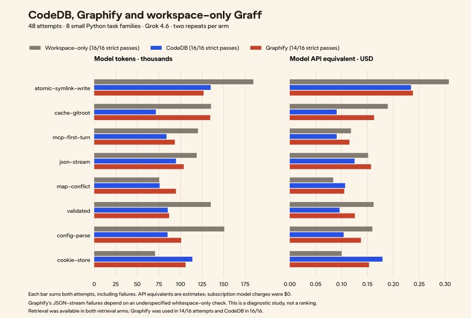

# CodeDB, Graphify and Graff: a broader repair study

On 2026-09-12 we ran **48 repair attempts across eight Python task families**:
CodeGraff with CodeDB, CodeGraff with Graphify, and a workspace-only baseline,
using Grok 4.6 and two attempts per configuration. CodeDB and the baseline
passed 16/16 strict graders; Graphify passed 14/16. Both Graphify failures
depend on the same underspecified whitespace-only JSON-sequence check. Omitting
just that assertion in a separate sensitivity check removes the correctness
difference. The strict scores remain unchanged.

Across all attempts, the CodeDB arm used **12.0% fewer model tokens than the
Graphify arm** and **24.8% fewer than the baseline**. Its estimated model API
cost was 14.0% and 19.3% lower, respectively. These are observations from small
fixtures, not a general product ranking or cash savings on our subscription.
Two Graphify-arm attempts did not call retrieval at all, despite the prompt
requesting it; both remain in the totals.



## Results

“Baseline” means Graff with the same five workspace MCP tools and no retrieval
server. Built-in local tools were disabled in every arm. This is a controlled
workspace baseline, **not stock Graff defaults**.

| Measurement, across 16 attempts per arm | Workspace-only | CodeDB | Graphify |
| --- | ---: | ---: | ---: |
| Strict grader passes | 16/16 | 16/16 | 14/16 |
| Input tokens, including cached input | 942,781 | 694,480 | 803,745 |
| Cached input tokens | 597,120 | 441,088 | 444,544 |
| Uncached input tokens | 345,661 | 253,392 | 359,201 |
| Output tokens | 47,071 | 49,946 | 42,329 |
| Total model tokens | 989,852 | 744,426 | 846,074 |
| Model calls | 137 | 104 | 107 |
| Retrieval calls | 0 | 53 | 47 |
| Workspace calls | 108 | 103 | 102 |
| Attempts actually using retrieval | 0/16 | 16/16 | 14/16 |
| Estimated model API equivalent | $1.272308 | $1.027004 | $1.194648 |
| API equivalent per strict pass, including failed-attempt spend | $0.079519 | $0.064188 | $0.085332 |
| Reported incremental subscription model charge | $0 | $0 | $0 |
| Sum of agent wall times, including MCP startup | 837.6 s | 870.5 s | 729.8 s |
| Sum of explicit index setup times | Not required | 12.51 s | 2.59 s |

All 48 attempts completed without timeouts. Every test/specification/facade hash
was unchanged, and every startup log contained only the assigned servers. No
workspace or retrieval MCP response was marked as an error. These checks do
not establish that every retrieved snippet was complete or every repair is
correct beyond the supplied tests.

The [portable receipt](study-v3/results-v3.json)
contains every attempt, counts, hashes, task order, prompts and preflight checks.
The [saved repairs](study-v3/solutions-v3.json) were
independently materialized and regraded: **48/48 reproduced their recorded
pass/fail outcome**, using Python 3.14.5 after the original Python 3.14.3 run.
The [regrade receipt](study-v3/regrade-verification.json)
records those outcomes. No model attempt was retried to improve the score.

## What the extra tasks cover

We expanded the previous three-family repair pilot with five unchanged tasks
from CodeGraff's existing evaluation suite. The first three were already
observed; the other five were new to this comparison. That does not establish
that they were unseen in model training. All eight are now observed regression
material. These are distilled Python fixtures, even where their source labels
refer to projects written in other languages.

| Family | Behavior exercised | Workspace / CodeDB / Graphify passes |
| --- | --- | --- |
| Atomic symlink write | Preserve links, partial/interrupted writes, cycles and revisiting a link with remaining path components | 2 / 2 / 2 |
| Git-root affinity | Nested working directories, worktree metadata and fallback behavior | 2 / 2 / 2 |
| MCP first turn | Multi-file startup policy, imported/project server merging and one-time skip state | 2 / 2 / 2 |
| JSON streams | Media types, trailing data, line delimiters, record separators and consumed streams | 2 / 2 / 0* |
| Map conflicts | Repeated writes/deletes, conflict metadata and atomic transaction rollback | 2 / 2 / 2 |
| Validated values | Error accumulation order, short-circuiting and pattern matching | 2 / 2 / 2 |
| Config parsing | File precedence, merging, nested keys, comments and false/zero values | 2 / 2 / 2 |
| Cookie store | Domain/path rules, eviction order, expiration and secure prefixes | 2 / 2 / 2 |

Before model calls, every frozen broken fixture failed its grader and every
reference repair passed. Inputs, graders, runner files and stable executables
were hashed before the experiment. Executable hashes were checked again after
the last block. No CodeDB ranking or runtime change was made during the study.

## Where each configuration did well

CodeDB used fewer aggregate tokens than Graphify in six of eight families.
The largest absolute difference was Git-root affinity: 71,410 versus 134,390
tokens over two attempts, with both repairs passing in each arm. CodeDB also
used fewer tokens for the multi-file MCP task and configuration parsing.
This suggests useful follow-up cases; it does not isolate retrieval as the
cause, because tool schemas, model decisions and cache reuse also differ.

Graphify's repairs passed every family except the disputed JSON boundary. Its
arm used fewer tokens than CodeDB on atomic symlink writes and cookie storage.
Its aggregate API equivalent was slightly lower for map conflicts and lower
for cookies. The Graphify arm also had the lower summed wall time, although
the concurrent design does not support a clean latency claim.

The workspace-only baseline passed everything and used the fewest tokens and
lowest API equivalent on map conflicts and cookies. Small tasks with the
implementation file named in the prompt can be solved efficiently through
direct reading. Retrieval should earn its additional work; these results do
not justify requiring it for every edit.

## Failures, ambiguity and protocol deviations

Both Graphify JSON-stream repairs passed the visible tests, then failed:

```python
assert list(iter_json("application/json-seq", "   ")) == []
```

The specification says an “empty payload” yields nothing, without explicitly
defining whitespace-only payloads. Both generated repairs attempted to decode
the spaces as a JSON value. One raised `DecodingError`; the other propagated
`JSONDecodeError`. This is a reproducible strict-grader failure, but an
underspecified contract prevents a strong claim of implementation error.

A post-hoc diagnostic omitted only that assertion. All six saved JSON-stream
repairs then passed the remaining hidden checks. The original fixtures and
strict scores were not changed. With that boundary omitted, all three arms
would have 16/16 passes. Excluding the entire JSON-stream family instead,
CodeDB still used 12.5% fewer tokens and a 13.1% lower model API equivalent than
Graphify across the remaining seven families.

Graphify was connected but unused in `validated-r2` and `cookie-store-r2`.
Those are deviations from the request to inspect through retrieval first.
We retain them because removing an inexpensive successful attempt after
seeing the outcome would bias the comparison. The primary totals therefore
compare **configured tool availability**, not 16 guaranteed retrieval uses per
tool. The next protocol should choose explicitly between optional retrieval
and an enforced first retrieval step.

## Token cost accounting

Input counts already include cached input. We used the published Grok 4.6
rates checked on 2026-09-12: $2 per million uncached input tokens, $0.50 per
million cached input tokens and $6 per million output tokens.
[xAI model documentation](https://docs.x.ai/developers/models/grok-4.6)

```text
API equivalent = (2 × (input − cached) + 0.5 × cached + 6 × output) / 1,000,000
```

Every attempt's aggregate input was below 200,000 tokens, so no individual
request could exceed that input threshold. The estimates include unsuccessful
attempts. Cost per strict pass divides all arm spend by its strict passes;
it does not assume failed work was repaired for free. Its denominator is
sensitive to the disputed JSON check, so read it alongside that analysis.

Graff used the existing subscription route and reported $0 incremental model
charges for every attempt. The API equivalents are **not measured cash savings**.
They exclude subscription fees, hosted Jina embeddings, installation, machine
costs and any follow-up repair work. Cache reuse was measured but not controlled.
Fewer total tokens need not imply proportionally lower cost: cached and output
tokens have different rates.

## Controls and limits

All arms used Graff 0.0.296, `--yolo`, the route `xai/grok-4.6`, identical task
and system prompts, 16 model calls, 40 tool calls and a 300-second wall limit.
The shared tools provided listing, literal search, reading, allowlisted edits
and visible tests. Hidden graders remained outside the agent root. No native
local tools, web search or subagents were available.

CodeDB used the frozen unreleased [PR #750](https://github.com/justrach/codedb/pull/750)
binary with hosted Jina and local OpenPuffer ANN. Graphify 0.9.58 was pinned to
[commit 23f2ffaa](https://github.com/Graphify-Labs/graphify/tree/23f2ffaa43fd12f25d9eabe91e6d184b5d89b474).
Every fixture had an explicitly prepared semantic index or AST-only graph.
Setup times exclude package installation and compare different indexing work.
This does not measure first-install success, default interoperability or
automatic index refresh.

Three arms ran concurrently within each matched task/repeat block; blocks ran
sequentially and launch order rotated. CPU, memory and provider contention
confound wall times. Two attempts on each of eight small families do not
support population-level confidence or a broad speed claim. Most prompts
identify the target file; only one family requires multi-file integration.
We have not tested large repositories, additional languages or other models.

Graff required explicit configuration isolation, companion opt-outs and the
initialized MCP handshake workaround described in the
[earlier source-understanding pilot](../../docs/graff-graphify-experiment.md). The new
workspace search/listing tools, baseline and concurrent scheduling also mean
these totals should not be compared directly with earlier pilot totals.

## Reproduce and extend

The [fixture bundle and instructions](README.md)
include the exact inputs, hidden graders, source attribution and full source
license. Regrading saved repairs requires no model calls; a new live experiment
requires authenticated tools and isolated configuration. The bundle also
includes [exact captured MCP and CLI traces](study-v3/traces-v3.tar.gz),
[per-file checksums](study-v3/traces-v3.json) and the original runner source.
Authentication stores and session configuration are
excluded. Raw provider HTTP traffic and a complete model transcript were not
captured; the archive cannot supply those. See the bundle instructions for
verification, extraction and regeneration of the Gramatika chart.

The next useful tests address gaps this study actually exposed:

1. Define whitespace-only JSON-sequence behavior explicitly, with visible
   boundary cases, then freeze a new version before collecting fresh runs.
   A clarified label is a test-contract repair, not a CodeDB improvement.
2. Compare optional retrieval with enforced retrieval on the same tasks.
   Keep a workspace baseline to measure when navigation overhead pays off.
3. Add larger, unfamiliar multi-file repositories and tasks that do not name
   the implementation file. Include dependency paths, similarly named symbols,
   test discovery and decoy files rather than only straightforward repair.
4. Test mutations between queries: modified definitions, renamed files and
   deleted callers. Verify refresh correctness separately from answer quality.
5. Exercise clean installation and default MCP startup, without the workarounds
   used here. That is necessary to answer whether the complete stack works out
   of the box.
6. Add source-body completeness regressions for the multiline Python signature
   truncation observed in the earlier pilot, followed by additional languages.
   That runtime issue was not fixed or reclassified by these repair scores.

These are proposed next experiments. The completed result here is the frozen
48-attempt study, its reproducible repairs and its documented limitations.
